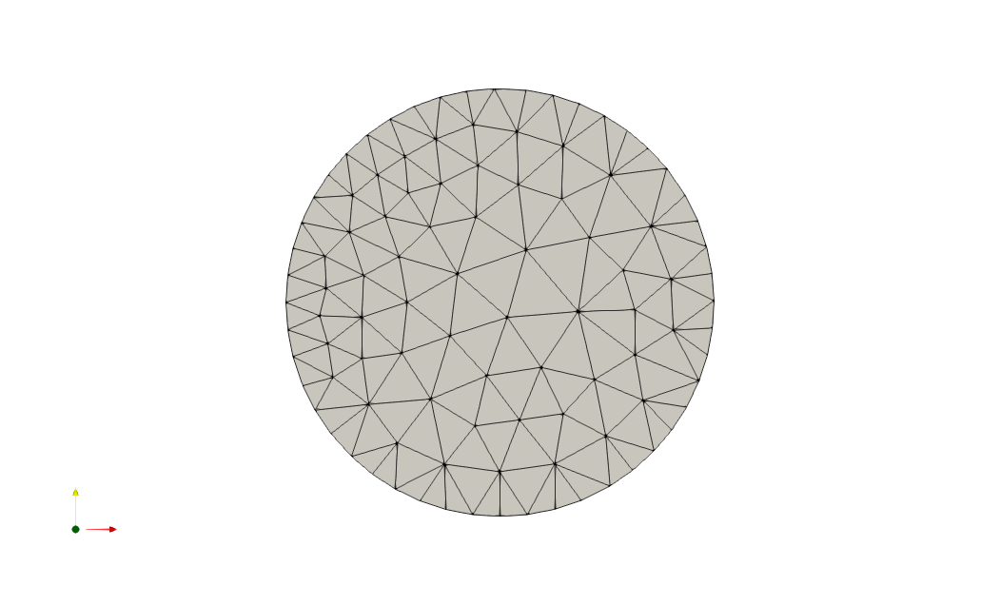
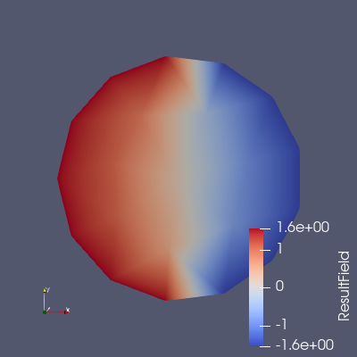
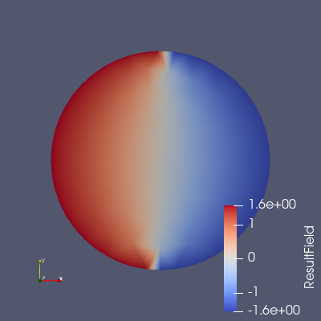
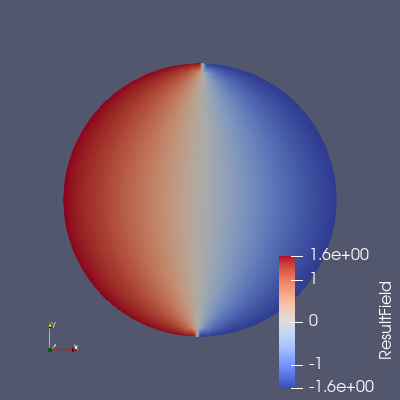
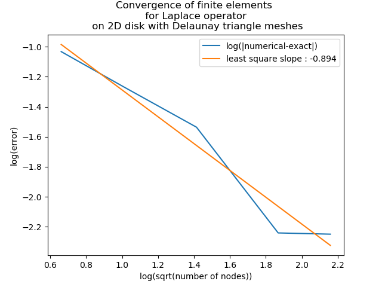
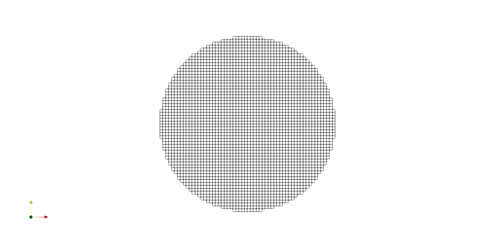
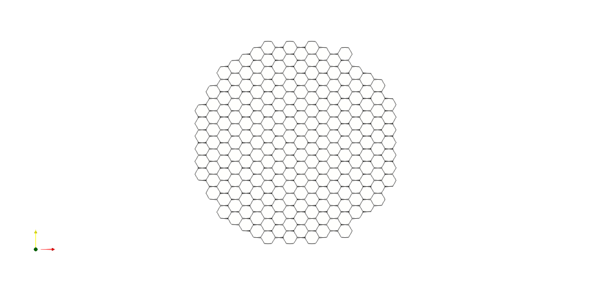
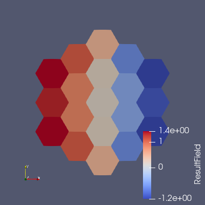
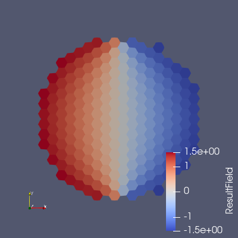
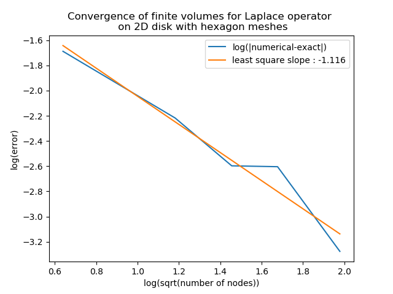

# Poisson problem with discontinuous boundary conditions

Let $\Omega\subset\mathbb{R}^d$ an open bounded set with Lipschitz boundary $\partial\Omega$, $f\in L^2(\partial\Omega)$ and $g\in L^2(\partial\Omega)$. We consider the following Dirichlet boundary value problem
$$
\left\{\begin{array}{c}
-\Delta u=f \textrm{ on } \Omega\\
u=0 \textrm{ on } \partial\Omega
\end{array}\right.
$$

The classical $H^1$-existence theory for elliptic equations using variational methods (section on the [variational approach](#classical-variational-approach)) requires that the boundary value $g$ be in $H^{\frac{1}{2}}(\partial\Omega)$ which excludes for instance discontinuous boundary values in 2D.
In physical and engineering sciences, boundary values are often discontinuous with $g\notin H^{\frac{1}{2}}(\partial\Omega)$.  
We give the example of a function that is harmonic (hence smooth) on the open disk $D(0,1)$, bounded on the closed disk $\bar D(0,1)$ and admits a continuous limit on the unit circle $C(0,1)$ except at two points of discontinuity (see section on an [ Example of solution $u\notin H^1(\Omega)$ with stiff BC on the disk](Example-of-solution-$u\notin H^1(\Omega)$- with-stiff-bc-on-the-disk)).
Numerical results obtained with finite elements and finite volume method show convergence of both methods with order 1 for the $L^2$ norm (see section on [Numerical results](numerical-results)). This is to be compared with the order 2 convergence observed for both the finite elements and finite volume methods for solutions in $H^1(\Omega)$.

## Classical variational approach

Provided $g\in H^{\frac{1}{2}}(\partial\Omega)$, we seek $u\in H^1_g(\Omega)$ such that
$$
\forall v\in H^1_g(\Omega),\quad \int_\Omega \vec\nabla u\cdot\vec\nabla v -\int_{\partial\Omega}g\vec\nabla u\cdot\mathrm{d}\vec s = \int_\Omega vf,
$$
where $H^1_g(\Omega)$ is the subspace of function having trace $g$ on $\Omega$ :
$$
H^1_g(\Omega) = \left\{w\in H^1(\Omega),\quad w_{|\Omega}=g\right\}.
$$
This functional setting is justified by the fact that the trace operator is continuous and bijective from $H^1(\Omega)$ to $H^\frac{1}{2}(\Omega)$ :
$$
\begin{array}{ccc}
H^1(\Omega) & \to & H^\frac{1}{2}(\Omega)\\
w & \to & w_{|\Omega}
\end{array}.
$$

Since the unknown $u$ of the variational problem (\ref{eq:weak form}) is in $H^1(\Omega)$, its boundary value $g$ is necessarily in $H^\frac{1}{2}(\Omega)$. Therefore we cannot consider a general function $g\in L^2(\Omega)$.\\
The reason the variational approach cannot admit low regularity boundary functions $g\in L^2(\Omega)$ is that the notion of boundary value is quite strong in the Sobolev context. The trace operator on the boundary must be a continuous operator defined for function in $H^{\frac{1}{2}}$. It is not possible to build the trace operator for general functions on $L^2(\Omega)$ (see remark 4.3.13 and exercice 4.3.4 in Allaire Numerical Analysis book).

## Example of solution $u\notin H^1(\Omega)$ with stiff BC on the disk

In this section we give an example of solution $u\notin H^1(\Omega)$ such that $u_{|\partial\Omega}=\lim_{x\to\partial\Omega}u\notin H^{\frac{1}{2}}(\Omega)$.\\

We consider the particular case of the following function defined on $D(0,1)$ :
$$
u:
\begin{array}{ccl}
D(0,1)&\to&\mathbb{R}\\
(x,y)&\to&arctan\left(\frac{2x}{x^2+y^2-1}\right)=arctan\left(\frac{2r\cos(\theta)}{r^2-1}\right)
\end{array}.
$$

 * $u$ is bounded on the closed disk $\bar D(0,1)$
 * $u\in C^\infty(D(0,1))$  and $u$ is harmonic in $D(0,1)$ since:
$$
\begin{array}{ccl}
\partial_{xx} u + \partial_{yy} u &=& \partial_x\left(\frac{2(x^2+y^2-1)-4x^2}{(x^2+y^2-1)^2}\frac{1}{1+\left(\frac{2x}{x^2+y^2-1}\right)^2}\right)\\
&&+\partial_y\left(\frac{-4xy}{(x^2+y^2-1)^2}\frac{1}{1+\left(\frac{2x}{x^2+y^2-1}\right)^2}\right)\\
&=&\partial_x\left(\frac{2(x^2+y^2-1)-4x^2}{(x^2+y^2-1)^2+4x^2}\right)\\
&&+\partial_y\left(\frac{-4xy}{(x^2+y^2-1)^2+4x^2}\right)\\
&=&\frac{-4x((x^2+y^2-1)^2+4x^2)-(4x(x^2+y^2-1)+8x)(2(x^2+y^2-1)-4x^2)}{((x^2+y^2-1)^2+4x^2)^2}\\
&&+\frac{-4x((x^2+y^2-1)^2+4x^2)+4xy4y(x^2+y^2-1)}{((x^2+y^2-1)^2+4x^2)^2}\\
&=&\frac{-16x(x^2+y^2-1)^2-32x^3+32x^3+(-16x+16x^3+16xy^2)(x^2+y^2-1)}{((x^2+y^2-1)^2+4x^2)^2}\\
&=&\frac{16x(x^2+y^2-1)(-(x^2+y^2-1)-1+x^2+y^2)}{((x^2+y^2-1)^2+4x^2)^2}\\
&=&0.
\end{array}.
$$
 *  The limit values of $u$ on the circle $C(0,1)$ exist except for $\theta=\frac{\pi}{2}$ and $\theta=-\frac{\pi}{2}$ and $u$ admit two discontinuites on the circle :
$$
u_{|\partial B(0,1)}:
\begin{array}{ccl}
C(0,1)&\to&\mathbb{R}\\
\theta&\to&
  \left\{\begin{array}{rcr}
    \frac{\pi}{2} & \textrm{if} & -\frac{\pi}{2}<\theta<\frac{\pi}{2}\\
   -\frac{\pi}{2} & \textrm{if} &  \frac{\pi}{2}<\theta<\frac{3\pi}{2}\\
  \end{array}\right.
\end{array},
$$
 * $u\notin H^1(\Omega)$, $u_{|\partial\Omega}=\lim_{x\to\partial\Omega}u\notin H^{\frac{1}{2}}(\Omega)$

$u$ is the argument of the following holomorphic function
$$
\frac{i+z}{i-z}=\frac{(1-x^2-y^2)-2ix}{x^2+(y-1)^2}Re^{iu}.
$$
(\ref{eq:u is argument}) gives another proof that $u$ is harmonic and that its poles are
$$
z=\pm i,
$$
which correspond to the two points of dicontinuity of $u$ on the unit circle.

## Numerical results
We solve numerically the following Poisson problem
$$
\left\{
\begin{array}{ccc}
-\Delta u (x) =0 & \textrm{if} & x\in D(0,1)\\
u(e^{i\theta})= \frac{\pi}{2} & \textrm{if} & \theta\in [\frac{\pi}{2},\frac{3\pi}{2}]\\
u(e^{i\theta})=-\frac{\pi}{2} & \textrm{if} & \theta\in [-\frac{\pi}{2},\frac{\pi}{2}]
\end{array};
\right.
$$
where the boundary value is a bounded discontinuous function.  
We measure the $l^2$ error between the finite element and volume approximations and the exact solution of (\ref{eq:Poisson problem num}) which is
$$
u(x,y)=arctan\left(\frac{2x}{x^2+y^2-1}\right).
$$

### Numerical results with finite element discretisations
mesh 1 | mesh 2 | mesh 3
     - | -    - | -
 |   |  

result 1 | result 2 | result 3
       - | -      - | -
 |   |  

### Numerical results with finite volume discretisations
#### Square meshes
mesh 1 | mesh 2 | mesh 3
     - | -    - | -
 |   |  

result 1 | result 2 | result 3
       - | -      - | -
 |   |  

#### Hexagonal meshes
mesh 1 | mesh 2 | mesh 3
     - | -    - | -
 |   |  

result 1 | result 2 | result 3
       - | -      - | -
 |   |  

