CoreFlows example scripts
=========================

- Stationary diffusion equation examples
    - [Problem Stationary diffusion 2D Finite Elements on structured triangles with Dirichlet boundary conditions (C)](../examples/StationaryDiffusionEquation_2DEF_StructuredTriangles.cxx)
    - [Problem Stationary diffusion 2D Finite Elements on structured triangles with Neumann boundary conditions (C)](../examples/StationaryDiffusionEquation_2DEF_StructuredTriangles_Neumann.cxx)
    - [Problem Stationary diffusion 2D Finite Elements on unstructured triangles with Dirichlet boundary conditions (C)](../examples/StationaryDiffusionEquation_2DEF_UnstructuredTriangles.cxx)
    - [Problem Stationary diffusion 3D Finite Elements on structured tetrahedra with Dirichlet boundary conditions (C)](../examples/StationaryDiffusionEquation_3DEF_StructuredTriangles.cxx)
    - [Problem Stationary diffusion 2D Finite Volumes on structured squares with Dirichlet boundary conditions (C)](../examples/StationaryDiffusionEquation_2DFV_StructuredSquares.cxx)
    - [Problem Stationary diffusion 2D Finite Volumes on structured triangles with Dirichlet boundary conditions (C)](../examples/StationaryDiffusionEquation_2DFV_StructuredTriangles.cxx)
    - [Problem Stationary diffusion 2D Finite Volumes on structured triangles with Neumann boundary conditions (C)](../examples/StationaryDiffusionEquation_2DFV_StructuredTriangles_Neumann.cxx)
    - [Problem Stationary diffusion 3D Finite Volumes on structured tetrahedra with Dirichlet boundary conditions (C)](../examples/StationaryDiffusionEquation_3DFV_StructuredTetrahedra.cxx)
    - [Problem Stationary diffusion 2D Finite Elements on structured triangles with Dirichlet boundary conditions (Python)](../examples/Python/StationaryDiffusionEquation_2DEF.py)
    - [Problem Stationary diffusion 2D Finite Elements on structured triangles with Neumann boundary conditions (Python)](../examples/Python/StationaryDiffusionEquation_2DEF_Neumann.py)
    - [Problem Stationary diffusion 3D Finite Elements on structured tetrahedra with Dirichlet boundary conditions tetrahedra (Python)](../examples/Python/StationaryDiffusionEquation_3DEF.py)
    - [Problem Stationary diffusion 2D Finite Volumes on structured squares with Dirichlet boundary conditions (Python)](../examples/Python/StationaryDiffusionEquation_2DVF_StructuredSquares.py)
    - [Problem Stationary diffusion 2D Finite Volumes on structured squares with Neumann boundary conditions (Python)](../examples/Python/StationaryDiffusionEquation_2DVF_StructuredSquares_Neumann.py)
    - [Problem Stationary diffusion 2D Finite Volumes on structured triangles with Dirichlet boundary conditions (Python)](../examples/Python/StationaryDiffusionEquation_2DVF_StructuredTriangles.py)
    - [Problem Stationary diffusion 2D Finite Volumes on structured cubes with Dirichlet boundary conditions (Python)](../examples/Python/StationaryDiffusionEquation_2DVF_StructuredCubes.py)
    - [Problem Stationary diffusion 2D Finite Volumes on structured tetrahedra with Dirichlet boundary conditions (Python)](../examples/Python/StationaryDiffusionEquation_2DVF_StructuredTetrahedra.py)

- Diffusion equation examples
    - [Problem Diffusion 1D Heated Rod (C)](../examples/DiffusionEquation_1DHeatedRod.cxx)
    - [Problem Diffusion 1D Heated Rod (Python)](../examples/Python/DiffusionEquation_1DHeatedRod.py)

- Transport equation examples
    - [Problem Transport 1D Heated Channel (C)](../examples/TransportEquation_1DHeatedChannel.cxx) 
    - [Problem Transport 1D Heated Channel (python)](../examples/Python/TransportEquation_1DHeatedChannel.py)

- Coupling of a transport and a diffusion equations
    - [Coupled Problem Transport Diffusion 1D Heated Channel (C)](../examples/CoupledTransportDiffusionEquations_1DHeatedChannel.cxx)

- Single phase examples
    - [Single Phase Problem 1D Heated Channel (C)](../examples/SinglePhase_1DHeatedChannel.cxx)
    - [Single Phase Problem 1D Heated Channel (Python)](../examples/Python/SinglePhase_1DHeatedChannel.py)
    - [Single Phase Problem 1D RiemannProblem (C)](../examples/SinglePhase_1DRiemannProblem.cxx)
    - [Single Phase Problem 1D RiemannProblem (Python)](../examples/Python/SinglePhase_1DRiemannProblem.py)
    - [Single Phase Problem 1D depressurisation (C)](../examples/SinglePhase_1DDepressurisation.cxx)
    - [Single Phase Problem 1D depressurisation (Python)](../examples/Python/SinglePhase_1DDepressurisation.py
)
    - [Single Phase Problem 1D water hammer (Python)](../examples/Python/SinglePhase_1DWaterHammer.py)
    - [Single Phase Problem 1D porosity jump (C)](../examples/SinglePhase_1DPorosityJump.cxx)

    | 2D Tests meshes for lid driven cavity test |   |  
    | --- | --- |  
    | 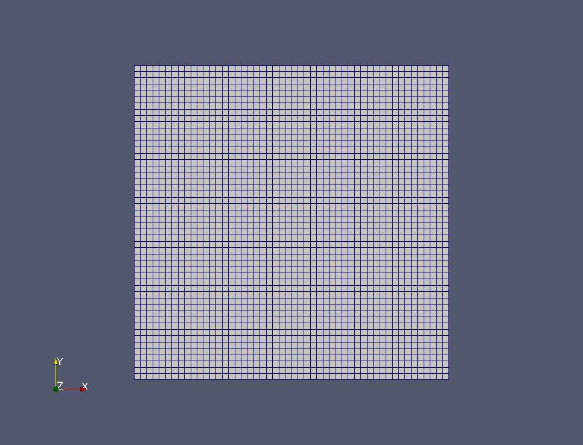 | 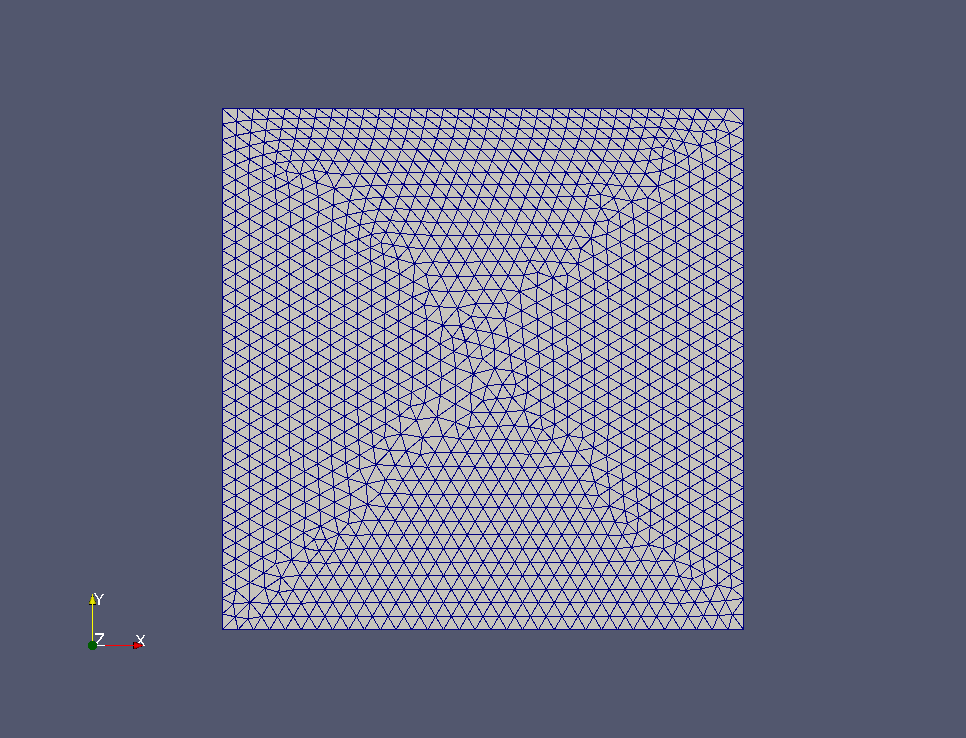 |  
    | 2D Structured mesh (squares) | Unstructured mesh (Delaunay triangles) |  

    - [Single Phase Problem 2D Lid driven cavity (C)](../examples/SinglePhase_2DLidDrivenCavity.cxx)
    - [Single Phase Problem 2D Lid driven cavity (Python)](../examples/Python/SinglePhase_2DLidDrivenCavity.py)
    - [Single Phase Problem 2D Lid driven cavity on an unstructured mesh (C)](../examples/SinglePhase_2DLidDrivenCavity_unstructured.cxx)
    - [Single Phase Problem 2D Lid driven cavity on an unstructured mesh (Python)](../examples/Python/SinglePhase_2DLidDrivenCavity_unstructured.py)

    | Results for lid driven cavity test |   |  
    | --- | --- |  
    | 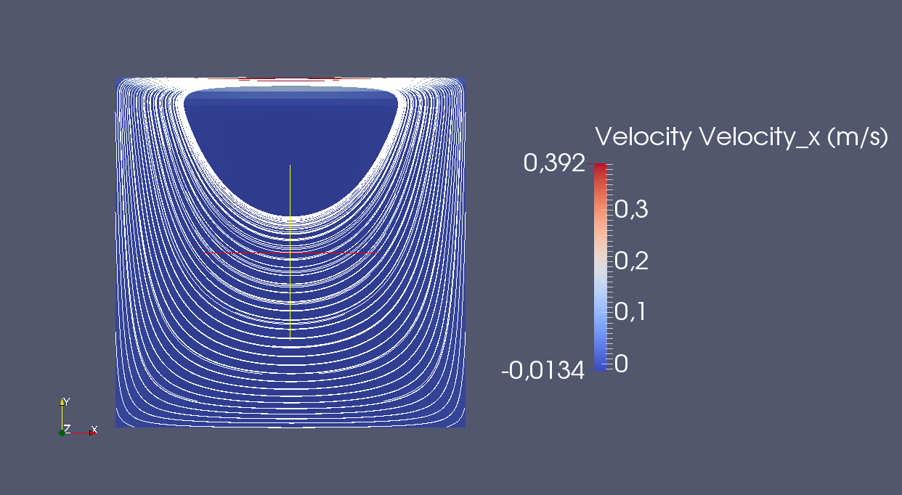 | 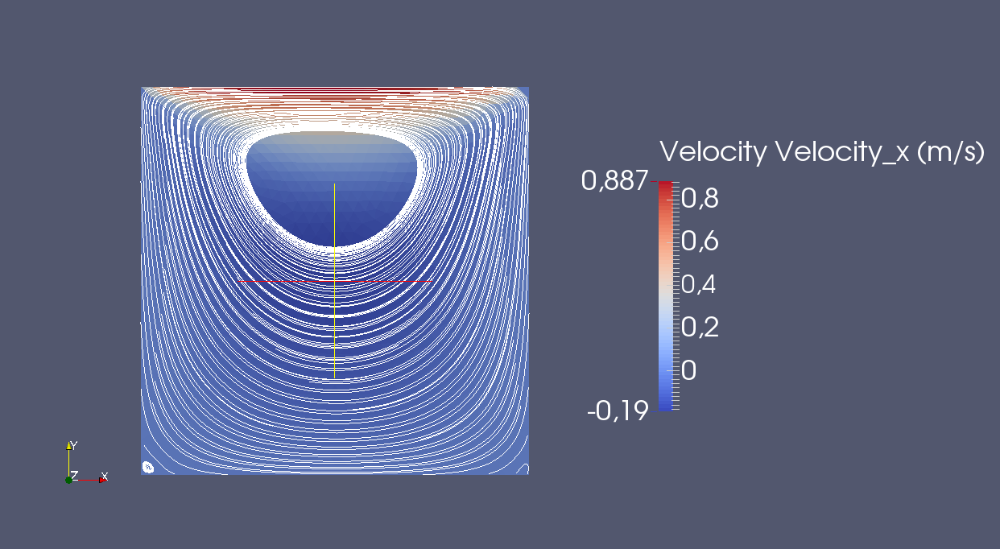 |  
    | Upwind scheme on structured mesh (squares) | Upwind scheme on unstructured mesh (Delaunay triangles) |  
    | 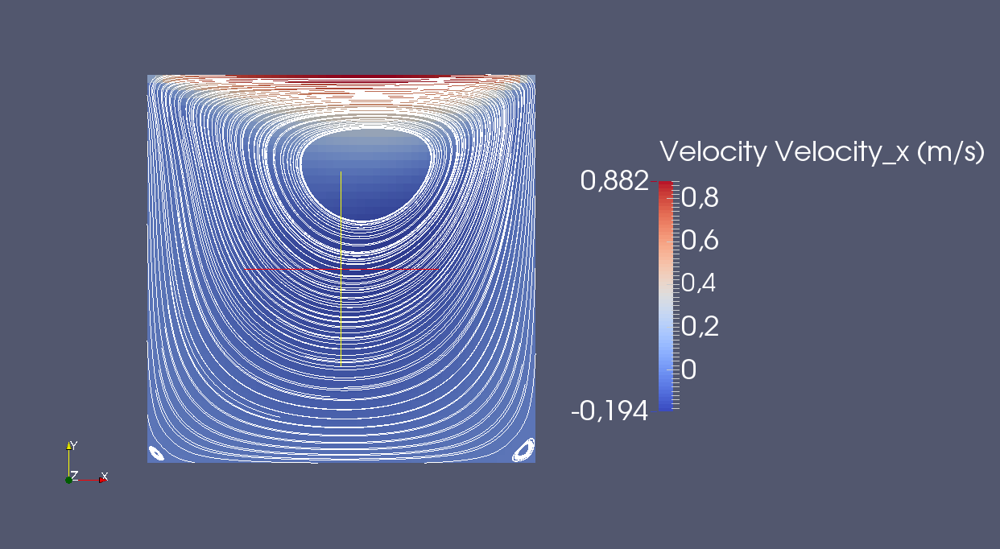 | 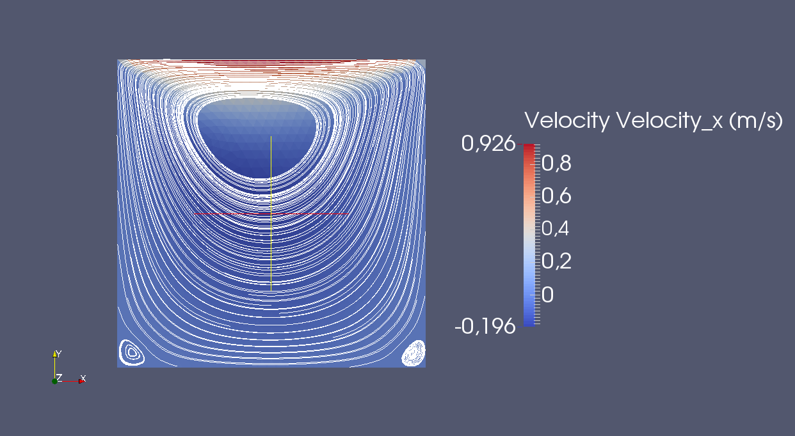 |  
    | LowMachDellacherieOmnes scheme on structured mesh (squares) | LowMachDellacherieOmnes scheme on unstructured mesh (Delaunay triangles) |  
    | 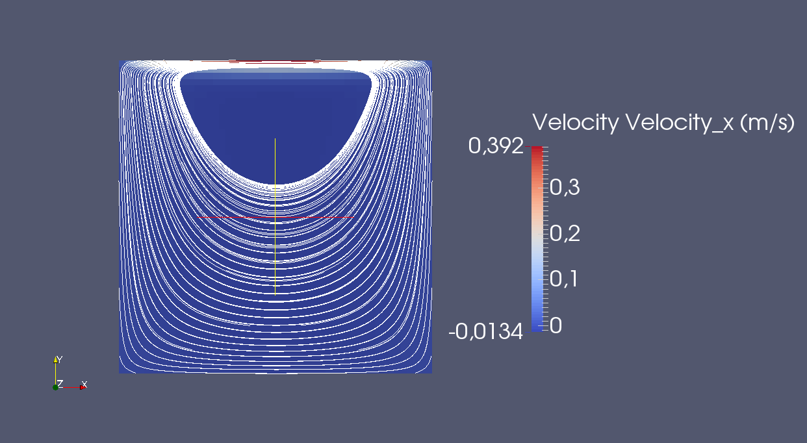 | 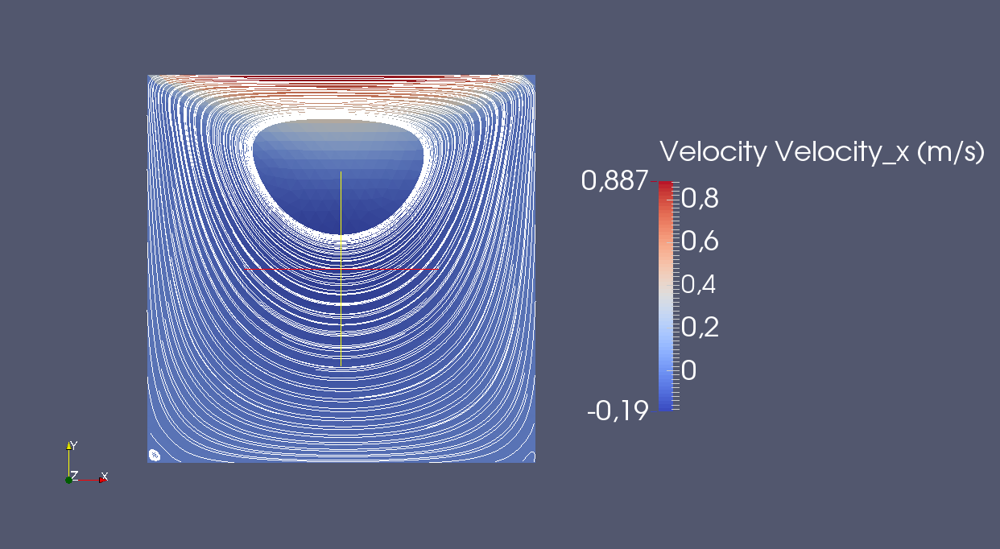 |  
    | Pseudo staggered scheme on structured mesh (squares) | Pseudo staggered scheme on unstructured mesh (Delaunay triangles) |  

    - [Single Phase Problem 2D Spherical wave on an unstructured mesh (C)](../examples/SinglePhase_2DSphericalExplosion_unstructured.cxx)
    - [Single Phase Problem 2D Spherical wave on an unstructured mesh (Python)](../examples/Python/SinglePhase_2DSphericalExplosion_unstructured.py)
    - [Single Phase Problem 2D Heated flow in inclined channel (Python)](../examples/Python/SinglePhase_2DHeatedChannelInclined.py)
    - [Single Phase Problem 2D Wall heated Channel with cross section change (C)](../examples/SinglePhase_2DWallHeatedChannel_ChangeSect.cxx)
    - [Single Phase Problem Heated wire with 2 Branches (C)](../examples/SinglePhase_HeatedWire_2Branches.cxx)
    
    | 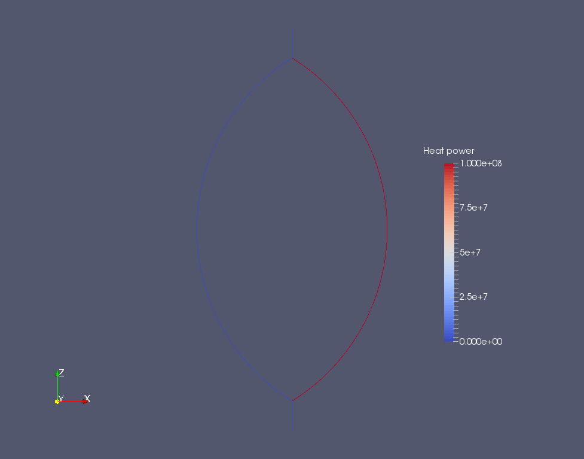 | 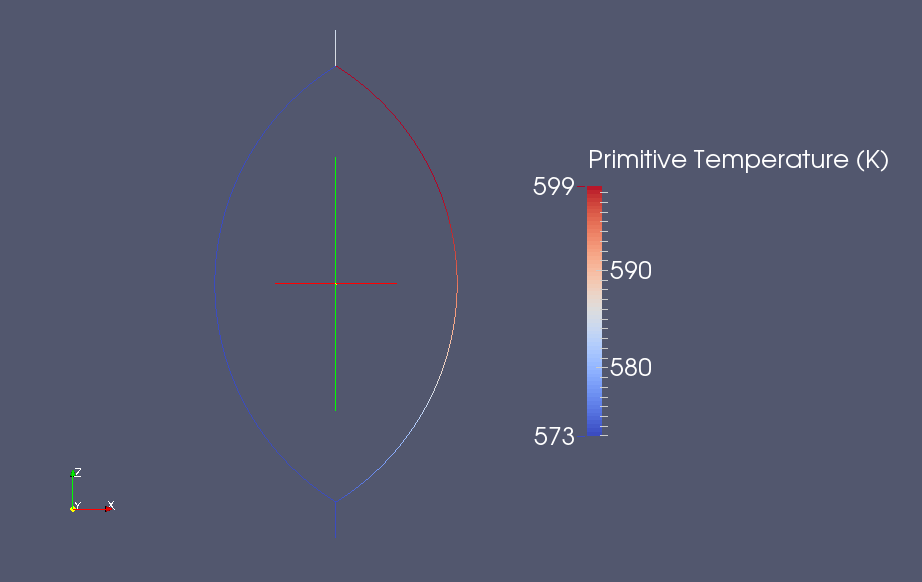 |  
    | --- | --- |  
    | Power field of the heated wire problem | Stationary temperature field of the heated wire problem |  

    - [Single Phase Problem Heated wire with 2 Branches (Python)](../examples/Python/SinglePhase_2BranchesHeatedChannels.py)
    - [Single Phase Problem 2D Thermal conduction (Python)](../examples/Python/SinglePhase_2DThermalDiffusion.py)

    | 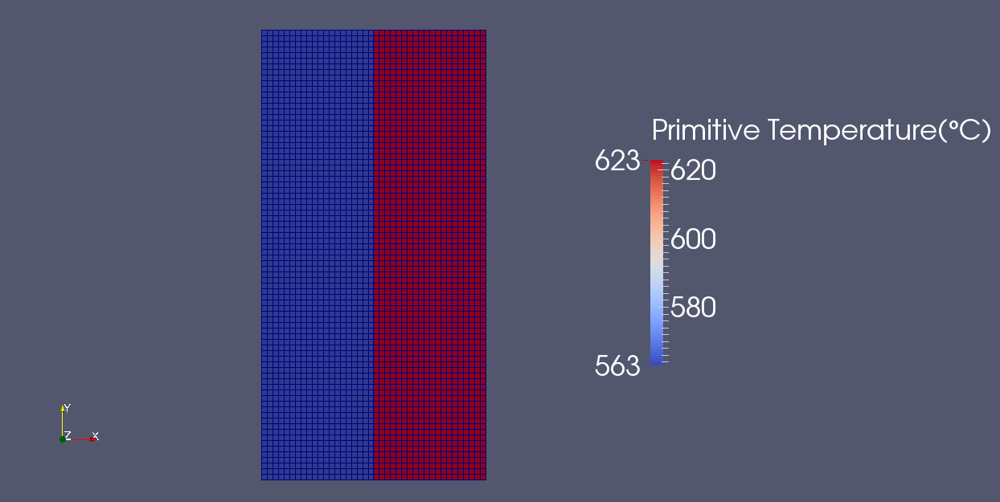 | 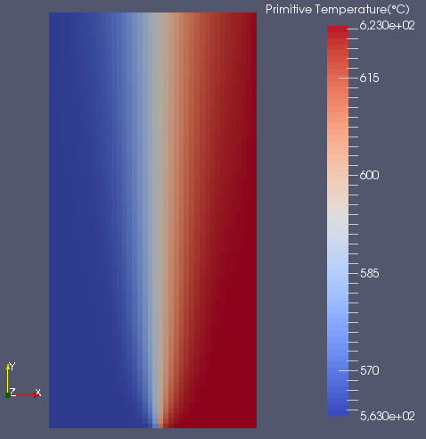 |  
    | --- | --- |  
    | Initial data and mesh for the 2D thermal diffusion problem | Stationary solution for the 2D thermal diffusion problem |  
    
    - [Single Phase 2D tank drainage problem (Python)](../examples/Python/SinglePhase_2DVidangeReservoir.py)
    - [Single Phase Problem 3D Heat driven cavity (C)](../examples/SinglePhase_3DHeatDrivenCavity.cxx)
    - [Single Phase Problem 3D Heat driven cavity (Python)](../examples/Python/SinglePhase_3DHeatDrivenCavity.py)

- " The Drift Model"
    - [Drift Model 1D Riemann problem (C)](../examples/DriftModel_1DRiemannProblem.cxx)
    - [Drift Model 1D Riemann problem (Python)](../examples/Python/DriftModel_1DRiemannProblem.py)
    - [Drift Model 1D depressurisation (C)](../examples/DriftModel_1DDepressurisation.cxx)
    - [Drift Model 1D depressurisation (Python)](../examples/Python/DriftModel_1DDepressurisation.py)
    - [Drift Model 1D pressure loss (C)](../examples/DriftModel_1DPressureLoss.cxx)
    - [Drift Model 1D pressure loss (Python)](../examples/Python/DriftModel_1DPressureLoss.py)
    - [Drift Model 1D porosity jump (C)](../examples/DriftModel_1DPorosityJump.cxx)
    - [Drift Model 1D porosity jump (Python)](../examples/Python/DriftModel_1DPorosityJump.py)
    - [Drift Model 1D Boiling Channel (C)](../examples/DriftModel_1DBoilingChannel.cxx)
    - [Drift Model 1D Boiling Channel (Python)](../examples/Python/DriftModel_1DBoilingChannel.py)
    - [Drift Model 1D Boiling Assembly (Python)](../examples/Python/DriftModel_1DAssembly.py)
    - [Drift Model 1D tank drainage problem (Python)](../examples/Python/DriftModel_1DVidangeReservoir.py)
    - [Drift Model 2D pressure loss (Python)](../examples/Python/DriftModel_2DPressureLoss.py)
    - [Drift Model 2D porosity jump (Python)](../examples/Python/DriftModel_2DPorosityJump.py)
    - [Drift Model 2D Inclined Boiling Channel (C)](../examples/DriftModel_2DInclinedBoilingChannel.cxx)
    - [Drift Model 2D Inclined Boiling Channel (Python)](../examples/Python/DriftModel_2DInclinedBoilingChannel.py)
    - [Drift Model 2D Inclined Channel with Gravity (C)](../examples/DriftModel_2DInclinedChannelGravity.cxx)
    - [Drift Model 2D Inclined Channel with Gravity (Python)](../examples/Python/DriftModel_2DInclinedChannelGravity.py)

    | 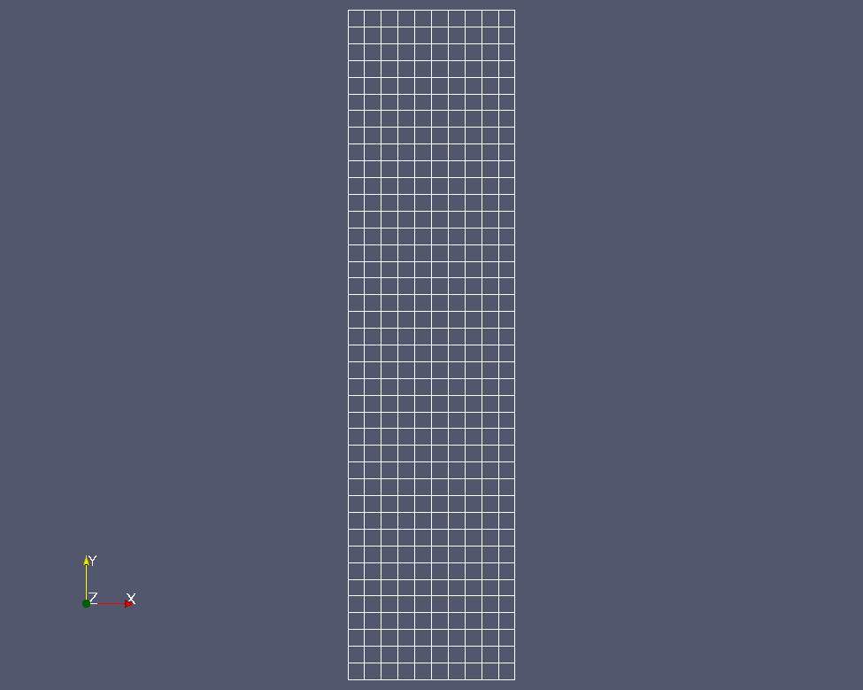 | 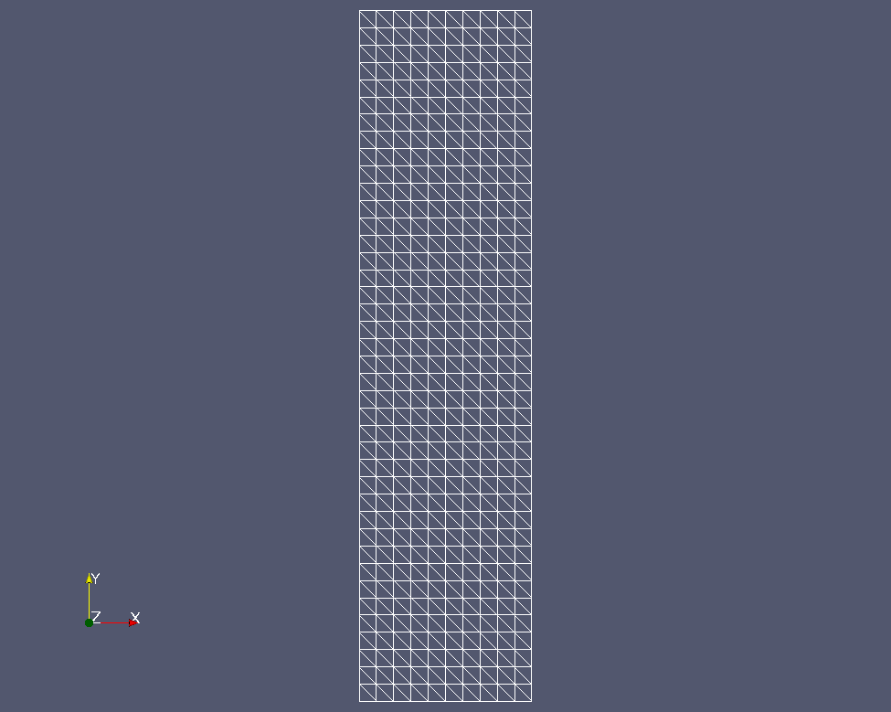 |  
    | --- | --- |  
    | Structured mesh with square cells for the 2D Vertical Inclined channel with gravity | Structured mesh with triangular cells for the 2D Vertical Inclined channel with gravity |  
    
    - [Drift Model 2D Inclined Channel with Gravity on a triangular mesh (Python)](../examples/Python/DriftModel_2DInclinedChannelGravityTriangles.py)
    - [Drift Model 2D Inclined Channel with Gravity and three barriers (C)](../examples/DriftModel_2DInclinedChannelGravityBarriers.cxx)
    - [Drift Model 2D Inclined Channel with Gravity and three barriers (Python)](../examples/Python/DriftModel_2DInclinedChannelGravityBarriers.py)
    - [Drift Model 2D Vertical Boiling Channel with a barrier (Python)](../examples/Python/DriftModel_2DBoilingChannelBarrier.py)

    | 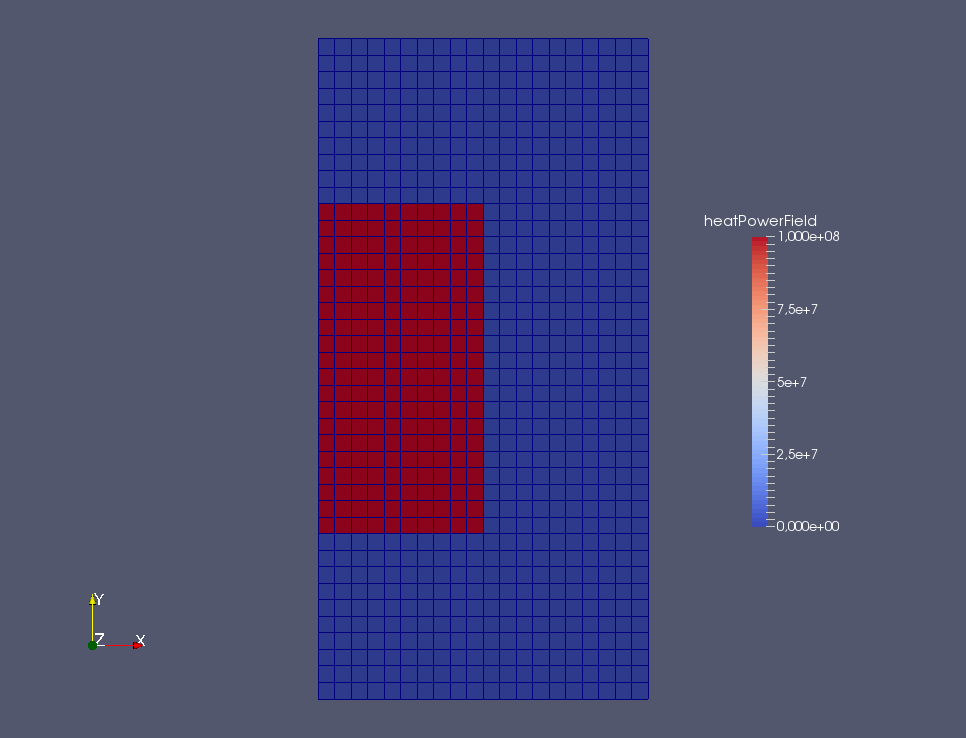 |   |  
    | --- | --- |  
    | Mesh and heat power field for the 2D Vertical Boiling Channel with a barrier |   |  
    | 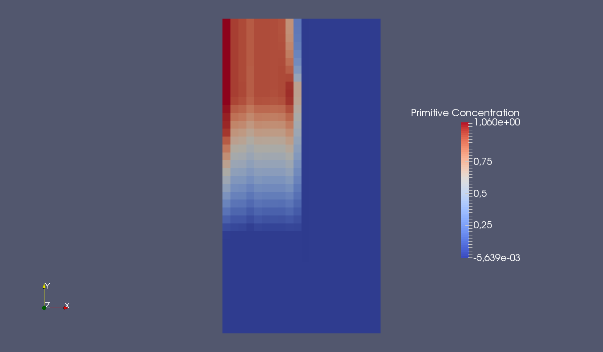 |  |  
    | Stationary concentration field and streamlines, 2D Vertical Boiling Channel with a barrier | Stationary velocity field and streamlines, 2D Vertical Boiling Channel with a barrier |  

    - [Drift Model 2D Inclined Boiling Channel with a barrier (Python)](../examples/Python/DriftModel_2DInclinedBoilingChannelBarrier.py)

    |  |  |  
    | --- | --- |  
    | Mesh and heat power field for the 2D inclined Vertical Boiling Channel with a barrier | Stationary concentration field and streamlines 2D inclined  Vertical Boiling Channel with a barrier |  

    - [Drift Model boiling wire with two Branches (Python)](../examples/Python/DriftModel_2BranchesBoilingChannels.py)
    - [Drift Model 3D Vertical Boiling Channel with two barriers (Python)](../examples/Python/DriftModel_3DBoilingChannelBarrier.py)

    | 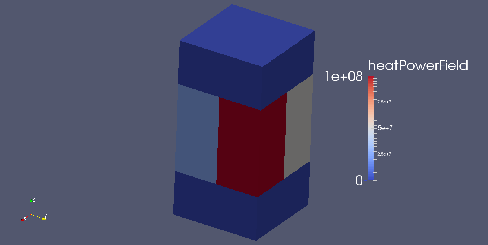 | 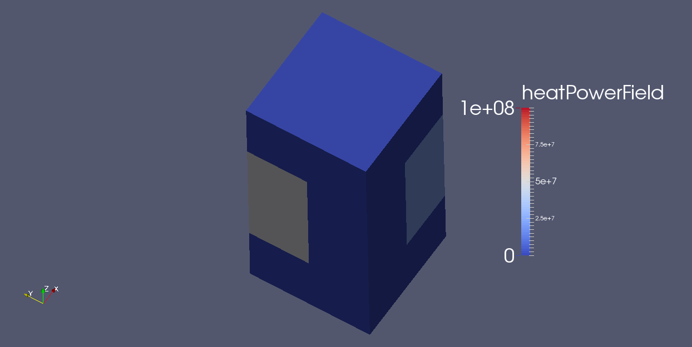 |  
    | --- | --- |  
    | Front view of the power field for the 3D Vertical Boiling Channel with two barrier | Rear view of the power field for the 3D Vertical Boiling Channel with two barrier |  

    | 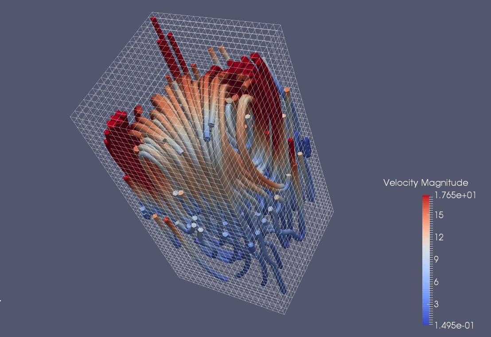 |  
    | --- |  
    | Streamlines at time step 7300 for the 3D Vertical Boiling Channel with two barrier |  

    - [Drift Model 2D tank drainage problem (Python)](../examples/Python/DriftModel_2DVidangeReservoir.py)
    - [Drift Model 2D tank drainage problem with an unstructured mesh (Python)](../examples/Python/DriftModel_2DVidangeReservoirUnstructured.py)

- The Isothermal TwoFluid model
    - [Isothermal 1D RiemannProblem  (C)](../examples/IsothermalTwoFluid_1DRiemannProblem.cxx)
    - [Isothermal 1D Sedimentation  (C)](../examples/IsothermalTwoFluid_1DSedimentation.cxx)
    - [Isothermal 1D Sedimentation  (Python)](../examples/Python/IsothermalTwoFluid_1DSedimentation.py)
    - [Isothermal 1D Depressurisation  (C)](../examples/IsothermalTwoFluid_1DDepressurisation.cxx)
    - [Isothermal 1D Emptying tank  (Python)](../examples/Python/IsothermalTwoFluid_1DVidangeReservoir.py)
    - [IsothermalTwoFluid_2DInclinedSedimentation.cxx](../examples/Isothermal 2D Inclined Sedimentation  (C))
    - [Isothermal 2D Emptying tank  (C)](../examples/IsothermalTwoFluid_2DVidangeReservoir.cxx)
    - [Isothermal 2D Emptying tank  (Python)](../examples/Python/IsothermalTwoFluid_2DVidangeReservoir.py)

- The five equations model
    - [Five Equations Model 1D Riemann Problem  (C)](../examples/FiveEqsTwoFluid_1DRiemannProblem.cxx)
    - [Five Equations Model 1D Boiling Channel (C)](../examples/FiveEqsTwoFluid_1DBoilingChannel.cxx)
    - [Five Equations Model 1D Boiling Channel (Python)](../examples/Python/FiveEqsTwoFluid_1DBoilingChannel.py)
    - [Five Equations Model 1D Boiling Assembly (Python)](../examples/Python/FiveEqsTwoFluid_1DBoilingAssembly.py)
    - [Five Equations Model 1D Depressurisation  (C)](../examples/FiveEqsTwoFluid_1DDepressurisation.cxx)
    - [Five Equations Model 1D Emptying tank  (Python)](../examples/Python/FiveEqsTwoFluid_1DVidangeReservoir.py)
    - [Five Equations Model 2D Inclined Sedimentation  (C)](../examples/FiveEqsTwoFluid_2DInclinedSedimentation.cxx)
    - [Five Equations Model 2D Inclined Sedimentation  (Python)](../examples/Python/FiveEqsTwoFluid_2DInclinedSedimentation.py)

    | 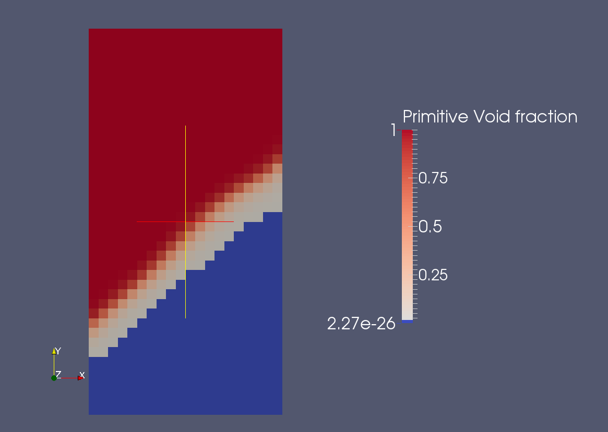 | 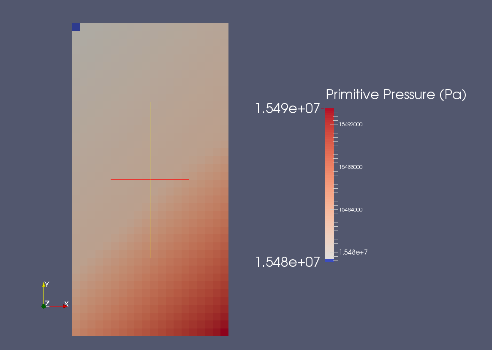 |  
    | --- | --- |  
    | Stationary void fraction | Stationary pressure |  
    | 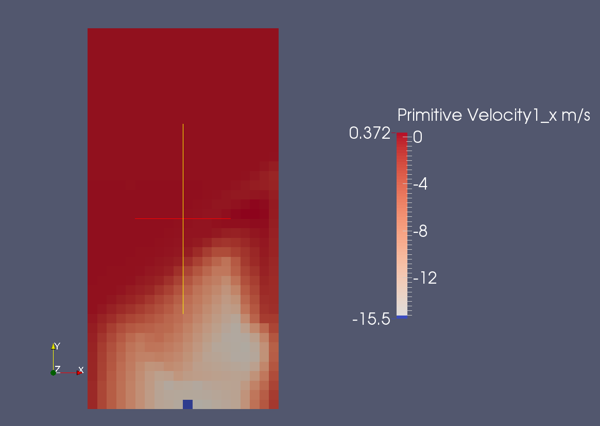 | 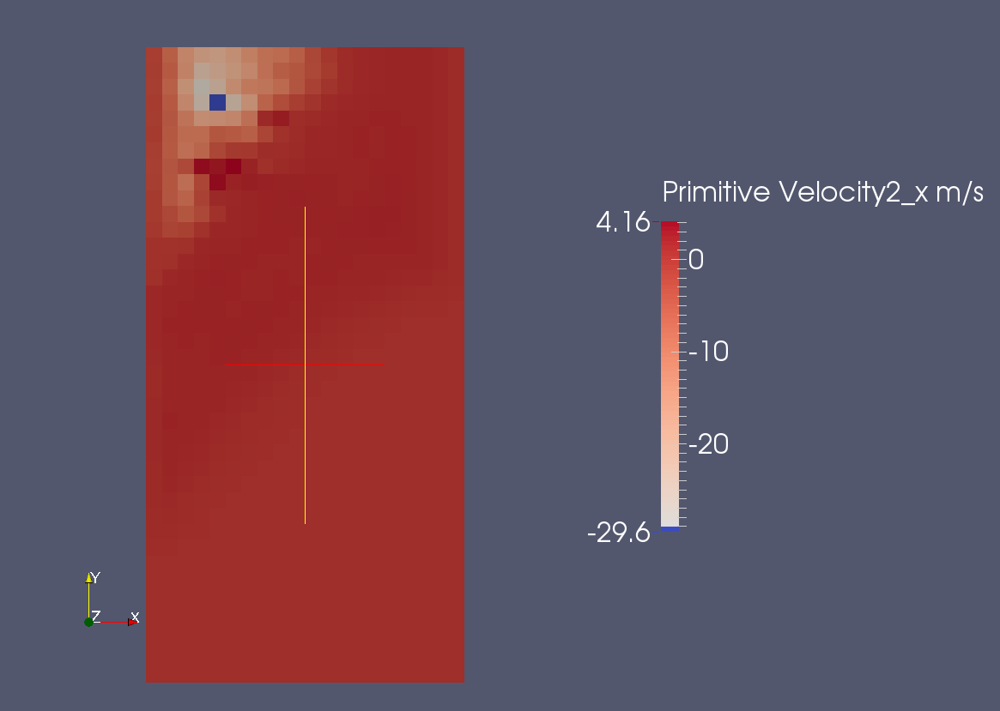 |  
    | Stationary gas velocity | Stationary liquid velocity |  

    - [Five Equations Model 2D Inclined Boiling Channel (C)](../examples/FiveEqsTwoFluid_2DInclinedBoilingChannel.cxx)
    - [Five Equations Model 2D Inclined Boiling Channel (Python)](../examples/Python/FiveEqsTwoFluid_2DInclinedBoilingChannel.py)
    - [Five Equations Model 2D Emptying tank  (Python)](../examples/Python/FiveEqsTwoFluid_2DVidangeReservoir.py)

