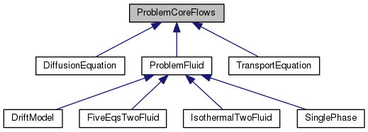

Software structure   
==================

CoreFlows is composed of 6 concrete classes dealing with specific models. They are listed in chronological order :

- [SinglePhase](../Models/inc/SinglePhase.hxx) implementing the compressible Navier-Stokes equations 
- [DriftModel](../Models/inc/DriftModel.hxx) implementing the 4 equation drift model
- [IsothermalTwoFluid](../Models/inc/IsothermalTwoFluid.hxx) implementing the isentropic two-fluid model 
- [FiveEqsTwoFluid](../Models/inc/FiveEqsTwoFluid.hxx) implementing the equal temperature two fluid model 
- [TransportEquation](../Models/inc/TransportEquation.hxx) implementing a scalar advection equation for the fluid enthalpy 
- [DiffusionEquation](../Models/inc/DiffusionEquation.hxx) implementing a scalar heat equation for the Uranium rods temperature 

On top of these classes there are two abstract classes that mutualise functions
that are common to several models.
- [ProblemFluid](../Models/inc/ProblemFluid.hxx) which contains the methods that are common to the non
scalar models : [SinglePhase](../Models/inc/SinglePhase.hxx) [DriftModel](../Models/inc/DriftModel.hxx) [IsothermalTwoFluid](../Models/inc/IsothermalTwoFluid.hxx) and [FiveEqsTwoFluid](../Models/inc/FiveEqsTwoFluid.hxx)
- [ProblemCoreFlows](../Models/inc/ProblemCoreFlows.hxx) which contains the methods that are common to the scalar and non scalar models: [ProblemFluid](../Models/inc/ProblemFluid.hxx), [TransportEquation](../Models/inc/TransportEquation.hxx) and [DiffusionEquation](../Models/inc/DiffusionEquation.hxx)

Here follows an inheritance diagram of CoreFlows  

The program can build simple geometries and meshes using the library [CDMATH-Toolbox](https://github.com/ndjinga/CDMATH) or load complex geometries and meshes written with the [MED](https://www.salome-platform.org/user-section/about/med) file system (see [SALOME](https://www.salome-platform.org/) ). The output files containing the fields resulting from the calculation can be either of [VTK](https://vtk.org/) or [MED](https://www.salome-platform.org/user-section/about/med) type. One can use [PARAVIEW](https://www.paraview.org/) (for [VTK](https://vtk.org/) files) or [SALOME](https://www.salome-platform.org/) (for [MED](https://www.salome-platform.org/user-section/about/med) files) to visualise the results.
Vector and matrices structures come from the [PETSC](https://www.mcs.anl.gov/petsc/) library. The matrices are stored in a block sparse format (type [baij](https://www.mcs.anl.gov/petsc/petsc-current/docs/manualpages/Mat/MATBAIJ.html) in [PETSC](https://www.mcs.anl.gov/petsc/) conventions). The default linear solver is [GMRES](https://www.mcs.anl.gov/petsc/petsc-current/docs/manualpages/KSP/KSPGMRES.html) and the default preconditioner is [ILU](https://www.mcs.anl.gov/petsc/petsc-current/docs/manualpages/PC/PCILU.html), both provided
by [PETSC](https://www.mcs.anl.gov/petsc/) .

