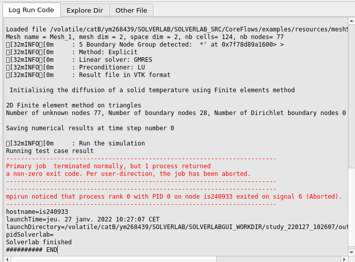

.. include:: ../rst_prolog.rst

.. _iraMainWidget:

Solverlab GUI main widget
==========================

This is the main window of the Solverlab GUI. It's composed of three parts:

#. The **TOOLBAR** is at the top and is used to realise quick action
#. The **TREE VIEW** is at the left and is used to import and modifie all data needed by Solverlab.
#. The **CONTENT TAB** is at the center/right and has diverse utility

.. image:: images/solverlabMainWidget1.png
   :scale: 75 %
   :align: center

Toolbar
------------

.. image:: images/solverlabMainWidgetToolbar1n.png
   :align: center

This toolbar contains icons related to actions, from left to right:

#. New Solverlab data. Create solverlab case from scratch
#. Load Solverlab data. Load case from previously saved case in a file Xml.
#. Save Solverlab data. Save current solverlab case in a file Xml.
#. Launch Solverlab calculus. Launch Solverlab code on current solverlab case.
#. Refresh SolverlabObjects tree view.
#. Clear Solverlab data model, remove Solverlab data tree (in SolverlabObject widget).
#. Solverlab GUI help. Display this current documentation in a browser (html mode).
#. Solverlab code help. Display Solverlab code manual in a browser (pdf mode).
#. Solverlab Example. Show directory with example of implemented model.

Solverlab tree view widget
----------------------------

From this tree view widget named *SolverlabObjects* users can prepare Solverlab code data.

.. image:: images/solverlabTreeViewWidget1.png
   :scale: 70 %
   :align: center

Modify tree view widget items values
++++++++++++++++++++++++++++++++++++++

There are some values as leaves of tree. Names and tooltips are *almost* as Solverlab code naming usage.

#. **Simple scalar values**.
   User can modify value on *mouse-left-double-click*, selecting tree item nodes **hovering column value**.
#. **Other specific values**.
   User can modify value on *mouse-right-click*, to get a contextual menu for modification,
   selecting tree item nodes **hovering columns name and value**.
   
.. note:: Some values are context specific and can be displayed only when they are needed.

Tree view widget menus
++++++++++++++++++++++++

There are some menus, as *contextual menu* on *mouse-right-click* when selected tree item nodes.
Some menu are generic, and other are specific to node, as contextual actions.
This is a **NOT exhaustive** list of menus:

Expand/collapse menu
++++++++++++++++++++++

.. image:: images/solverlabExpandMenu1.png
   :scale: 80 %
   :align: center

This menu contains some actions to expand or collapse all or selected part of
data tree.
To activate this menu users have to *mouse-right-click* on **head of arrow**
of tree item nodes (at **left** of item icon).

Delete/Insert menu
++++++++++++++++++++++

.. image:: images/solverlabDeleteMenu1.png
   :scale: 80 %
   :align: center

This menu contains some actions to insert, delete and reset all or selected part of
data tree.
To activate this menu users have to *mouse-right-click* on 'name' of tree item nodes
(at right of item icon).
The concerned items are usually not leaves (are items without a value).

Log Run Code widget
--------------------

This widget displays log trace of Solverlab code execution.

Solverlab code is executed when users activate *Launch Solverlab calculus* button
in the **TOOLBAR**.

Log Run Code widget menu
+++++++++++++++++++++++++

.. image:: images/solverlabLogWidgetMenu1.png
   :scale: 80 %
   :align: center

This menu contains some actions to display, but **also** edit all or selected part of
current log trace, considering log trace as an ascii file.
To activate this menu users have to *mouse-right-click* **somewhere in** Log Run Code widget.

.. note:: Using *Open* and *Save* actions in this menu, users can use this widget as
          an elementary text file viewer/editor.

Other File widget
------------------

This widget displays the content of the selected med file.
It use the MEDCoupling API to do so.

.. image:: images/solverlabOtherTab.png
    :align: center

The user can *mouse-right-click* on the fileMed field in the **TREE VIEW** and select the "Dump ascii content" context menu.

