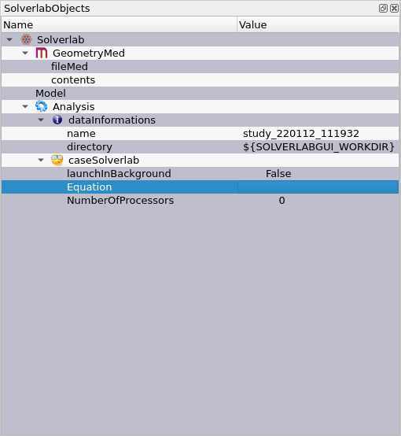

.. include:: ./rst_prolog.rst

.. _modelUsage:

Model
---------

This section will explicit all options of the implemented model in the GUI

The Solverlab Tree Object you can see in the **TREE VIEW** broke down as follows:

* GeometryMed

    * fileMed: the .med file you want to work on (you can import one by right-clicking and select "Browse file")
    * contents: read the selected file and display some important information about its content

* Model

    * List of Model (Right-click to add one)

* Analysis

    * datainformations
        * name: name of the directory where it will save your work
        * directory: location of the directory
        
    * caseSolverlab
        * launchInBackground: 
        * Equation: Choose which simulation to launch from the List of Model
        * NumberOfProcessors: If in background try to launch solverlab in multicore

Diffusion Equation
+++++++++++++++++++

You can see the documentation here (TODO put link to solverlab git hub doc)

.. image:: images/diffusionequationtree.png
    :align: center

Some value can be a scalar or use a field already in your .med file you can select which mode to use and the GUI will adapt itself.
(Todo show how to switch mode)
