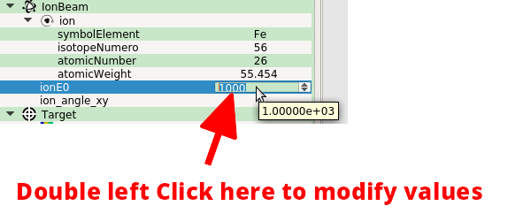

.. include:: ./rst_prolog.rst

.. _iraTips:

Tips
--------------------------

Tip 01
=======
.. image:: images_tips/tip_01_solverlabMainWidgetToolbar1.png
   :scale: 80 %
   :align: center

Tip 05
=======

Tip 08
=======
.. image:: images_tips/tip_08_solverlabMainWidgetToolbar1.png
   :scale: 80 %
   :align: center

Tip 20
=======
.. image:: images_tips/tip_20_expand.png
   :scale: 80 %
   :align: center

Tip 25
=======
.. image:: images_tips/tip_25_contextual_menu.png
   :scale: 80 %
   :align: center

Tip 28
=======
.. image:: images_tips/tip_28_mouseover_tooltip.png
   :scale: 80 %
   :align: center

Tip 30
=======

Tip 98
=======
.. image:: images_tips/tip_98_solverlabMainWidgetToolbar1.png
   :scale: 80 %
   :align: center

Tip 99
=======
.. image:: images_tips/tip_99_solverlabMainWidgetToolbar1.png
   :scale: 80 %
   :align: center

