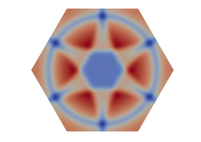

|  |
|:--:|
| **SOLVERLAB** |

Introduction
------------
SOLVERLAB is a geometrical and numerical C++/Python library designed for numerical analysts who work on the discretisation of partial differential equations on general shapes and meshes and would rather focus on high-level scripting. The goal is to provide simple MATLAB style functions for the generation and manipulation of meshes, fields and matrices. The library is based on the [MEDcoupling](https://docs.salome-platform.org/latest/dev/MEDCoupling/tutorial/index.html) C++/python library of the [SALOME](http://www.salome-platform.org/) project for the handling of meshes and fields, and on the C++ library [PETSC](https://www.mcs.anl.gov/petsc/) for the handling of matrices and linear solvers. 

SOLVERLAB includes PDE systems
arising from the modeling of nuclear reactor cores which involves fluid dynamics, heat and neutron diffusion as well as solid elasticity. It
is a simple environment meant at students and researchers for teachind and promote new numerical
methods on general geometries with unstructured meshes.  
The main research objectives of SOLVERLAB are the study of

- Numerical schemes for compressible flows at low Mach numbers on general meshes
- Well balanced schemes for stiff source terms (heat source, phase change, pressure losses)
- Numerical handling of flow inversion, phase disappearance and counter-currents in two phase flows
- Numerical handling of stiff porosity or cross section functions
- Schemes that preserve the phasic volume fraction α ∈ [0, 1]
- Convergence of finite volume methods
- New preconditioners for implicit methods for two phase flows
- The coupling of fluid models or multiphysics coupling (eg thermal hydraulics and neutronics or thermal hydraulics and solid thermics)

The library is currently maintained and distributed by the SALOME developpement team on various linux distributions (Ubuntu, CentOS, Fedora, Debian) and on Windows-10.
The corresponding binary files can be found  [here](https://www.salome-platform.org/?page_id=15).

Examples of use
---------------
- [Examples of stable numerical methods for the 1D linear transport equation](CDMATH/tests/doc/1DTransportEquation/RegularGrid/TransportEquation1D_RegularGrid.ipynb)
- [Shock formation and numerical capture issues for the 1D Burgers' equations](CDMATH/tests/doc/1DBurgersEquation/BurgersEquation1D.ipynb)
- [Influence of the mesh on the convergence and low Mach precision for the UPWIND finite volume method applied to the 2D wave system](CDMATH/tests/doc/2DWaveSystemVF_stationary/Convergence_WaveSystem_Upwind_SQUARE.ipynb)
- [Influence of the mesh on the convergence and low Mach precision  for the CENTERED finite volume method applied to the 2D wave system](CDMATH/tests/doc/2DWaveSystemVF_stationary/Convergence_WaveSystem_Centered_SQUARE.ipynb)
- [Influence of the mesh on the convergence and low Mach precision  for the STAGGERED finite volume method applied to the 2D wave system](CDMATH/tests/doc/2DWaveSystemVF_stationary/Convergence_WaveSystem_Staggered_SQUARE_squares.ipynb)
- [Influence of the mesh on the convergence and low Mach precision  for the PSEUDO-STAGGERED (colocated) finite volume method applied to the 2D wave system](CDMATH/tests/doc/2DWaveSystemVF_stationary/Convergence_WaveSystem_PStag_SQUARE.ipynb)
- [Finite elements for the Poisson problem on a cube in 3D (by S. Kameni Ngwamou, PhD student)](CDMATH/tests/doc/3DPoissonEF/FiniteElements3DPoisson_CUBE.ipynb)
- [Finite elements for the stationary diffusion of the temperature in a 3D room. Influence of the radiator position (by S. Kameni Ngwamou, PhD student)](CDMATH/tests/doc/3DRoomCoolingEF/3DRoomCoolingEF.ipynb)
- [Surface Finite elements for the Poisson-Beltrami problem on a sphere in 3D (by M. Nguemfouo, PhD student)](CDMATH/tests/doc/3DPoissonSphereEF/SynthesisConvergenceFESphere.pdf)
- [Surface Finite elements for the Poisson-Beltrami problem on a torus in 3D (by M. Nguemfouo, PhD student)](CDMATH/tests/doc/3DPoissonTorusEF/SynthesisConvergenceFETorus.pdf)

Download SOLVERLAB sources for compilation
----------------------------------
The easiest way to use SOLVERLAB is to download the SALOME binary file corresponding to your operating system [here](https://www.salome-platform.org/?page_id=15).
However the binary file can be very large (up to 5GB). Compilation of SOLVERLAB from source files can provide a better alternative using less disk and memory space.

To compile SOLVERLAB source, first create a source directory, for instance with:
* `mkdir ~/workspace/SOLVERLAB`
* `cd ~/workspace/SOLVERLAB`

Download SOLVERLAB source from GitHub
* click on the following link : `https://github.com/ndjinga/SOLVERLAB/archive/master.zip`, then unzip the file in a directory SOLVERLAB-master
* or type the following in a terminal : `wget https://github.com/ndjinga/SOLVERLAB/archive/master.zip`, then unzip the file in a directory SOLVERLAB-master
* or clone the git repository to a folder SOLVERLAB-master:  `git clone https://github.com/ndjinga/SOLVERLAB.git SOLVERLAB-master`

Set the environment for the compilation of SOLVERLAB
---------------------------------------------
Dependencies. The following package list is sufficient on Ubuntu 20.04 :

 - `cmake3` (mandatory)
 - `g++` or another C++ compiler (mandatory)
 - `python3-dev`, `python3-numpy` and `swig3`for python scripts (mandatory)
 - `pyqt5-dev-tools` to generate the Graphical User Interface (optional)
 - `python3-matplotlib`, `paraview-dev`, `libnetcdf-dev` (on Ubuntu 20.04) and `python3-paraview` for postprocessing tools such as plotting curves (matplotlib) or generating 3D view images (paraview) (optional)
 - `ffmpeg` and `ffmpeg-devel` to generate an animation from a set of curves (optional)
 - `python3-sphinx` for the GUI documentation, and `doxygen`, `graphviz` and `mscgen` to generate a developper documentation. Use the compilation option `-DSOLVERLAB_WITH_DOCUMENTATION=ON` (optional).
 - `libcppunit-dev`, if you want to generate unit tests. Use the compilation option `-DSOLVERLAB_WITH_TESTS=ON` (optional).
 - `rpm`, if you want to generate RPM installation packages. Use the compilation option `-DSOLVERLAB_WITH_PACKAGE=ON` (optional).

Directories. Create the suggested build and installation folders:
* `cd ~/workspace/SOLVERLAB`
* `mkdir SOLVERLAB_build`
* `mkdir SOLVERLAB_install`
* `cd SOLVERLAB_build`

Compile and install SOLVERLAB
--------------------------
Simpler build for a minimum version:
* `cmake ../SOLVERLAB-master/ -DCMAKE_INSTALL_PREFIX=../SOLVERLAB_install -DCMAKE_BUILD_TYPE=Release -DSOLVERLAB_WITH_DOCUMENTATION=ON -DSOLVERLAB_WITH_GUI=ON `  
> This will download and build the following dependencies
> - PETSc from http://ftp.mcs.anl.gov/pub/petsc/release-snapshots/petsc-3.16.0.tar.gz
> - SLEPc from https://slepc.upv.es/download/distrib/slepc-3.16.0.tar.gz
> - F2CBLASLAPACK from http://ftp.mcs.anl.gov/pub/petsc/externalpackages/f2cblaslapack-3.4.2.q4.tar.gz
> - HDF5 https://support.hdfgroup.org/ftp/HDF5/releases/hdf5-1.10/hdf5-1.10.3/src/hdf5-1.10.3.tar.gz
> - MEDFILE from http://files.salome-platform.org/Salome/other/med-4.1.0.tar.gz
> - MEDCOUPLING from http://files.salome-platform.org/Salome/other/medCoupling-9.8.0.tar.gz

If you already have an installation of PETSC, MED and MEDCoupling, you may save computational time and memory by using the following cmake instruction:
* `cmake ../SOLVERLAB-master -DCMAKE_INSTALL_PREFIX=../SOLVERLAB_install -DCMAKE_BUILD_TYPE=Release -G"Eclipse CDT4 - Unix Makefiles" -D_ECLIPSE_VERSION=4.3 -DSOLVERLAB_WITH_DOCUMENTATION=ON -DPETSC_DIR=${PETSC_DIR} -DPETSC_ARCH=${PETSC_ARCH} -DMEDFILE_ROOT_DIR=${MEDFILE_ROOT_DIR} -DMEDCOUPLING_ROOT_DIR=${MEDCOUPLING_ROOT_DIR}  -DSOLVERLAB_WITH_GUI=ON`  
> This assumes that you have an existing 
> - installation of PETSc (with submodules SLEPC and HDF5) at the location given by the environment variable PETSC_DIR and the architecture variable PETSC_ARCH  
> See the instructions given in [the official documentation](http://www.mcs.anl.gov/petsc/documentation/installation.html)
> - installation of MED                                    at the location given by the environment variable MEDFILE_ROOT_DIR
> - installation of MEDCOUPLING                            at the location given by the environment variable MEDCOUPLING_ROOT_DIR

The 3 dependencies PETSC, MED and MEDCOUPLING should have been compiled with the same version of HDF5  
Warning : the linux package libhdf5-dev is generally not compatible with the libraries MED and MEDCoupling  
Compile and install:
* `make`
* `make install`

Run unit and example tests:
* make examples

Run validation tests:
* make validation

Generate documentation of CDMATH module
* make docCDMATH

Generate documentation of CoreFlows module
* make docCoreFlows

Use of SOLVERLAB
----------------

To use SOLVERLAB in your Python code `main.py `, you can load the SOLVERLAB environment in your terminal using the command
 * source `~/workspace/SOLVERLAB/SOLVERLAB_install/env_SOLVERLAB.sh`
Then in your terminal simply type
- `python3 main.py `

To use the Graphical User Interface of SOLVERLAB, you can load the SOLVERLAB environment in your terminal using the command
 * source `~/workspace/SOLVERLAB/SOLVERLAB_install/env_SOLVERLAB.sh`
Then in your terminal simply type
- `python3 $SOLVERLABGUI -g`

If performance or parallelism is an issue for your simulations, you can use SOLVERLAB librairies with your C++ code :
 * C++ libraries: `export LD_LIBRARY_PATH=~/workspace/SOLVERLAB/SOLVERLAB_install/lib`
 * To know how to include the right libraries for compilation, see the makefiles of the examples. They include the list ` -lmedC -lmedloader -lmedcoupling -lbase -lmesh -llinearsolver`.

The SOLVERLAB environment variables consist in :
 * SOLVERLAB C++ library path: `~/workspace/SOLVERLAB/SOLVERLAB_install/lib`
 * SOLVERLAB Python library paths: `~/workspace/SOLVERLAB/SOLVERLAB_install/lib/SOLVERLAB:~/workspace/SOLVERLAB/SOLVERLAB_install/bin/SOLVERLAB`
 * PETSc, SLEPc and HDF5 library path: `${PETSC_DIR}/${PETSC_ARCH}/lib`
 * MED library path: `${MEDFILE_ROOT_DIR}/lib`
 * MEDCOUPLING library path: `${MEDCOUPLING_ROOT_DIR}/lib`

Use of SOLVERLAB
----------------
A new GUI based on the library [PACKAGESPYGUI](https://github.com/ndjinga/PACKAGESPYGUI) is being developped for SOLVERLAB. In order to use the new GUI use the cmake option `-DSOLVERLAB_WITH_PACKAGESPY=ON` that will download the library [PACKAGESPYGUI](https://github.com/ndjinga/PACKAGESPYGUI) from github.
If you have a local copy of the library PACKAGESPY, give the to solverlab using the cmake option `-DPACKAGESPY_ROOT_DIR=${PACKAGESPY_ROOT_DIR}`.
