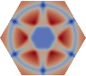

## SOLVERLAB

### Introduction

SOLVERLAB is a geometrical and numerical C++/Python library designed for numerical analysts
who work on the discretisation of partial differential equations on general shapes and meshes
and would rather focus on high-level scripting.

The goal is to provide simple MATLAB style functions for the generation and manipulation of meshes, fields and matrices.
The library is based on
[MEDcoupling](https://docs.salome-platform.org/latest/dev/MEDCoupling/tutorial/index.html),
and C++/python library of the
[SALOME](http://www.salome-platform.org/) project for the handling of meshes and fields,
and on the C++ library [PETSC](https://petsc.org/release/)
for the handling of matrices and linear solvers.

SOLVERLAB includes PDE systems arising from the modeling of nuclear reactor cores
which involves fluid dynamics, heat and neutron diffusion as well as solid elasticity.

It is a simple environment meant at students and researchers for teaching and promote new numerical
methods on general geometries with unstructured meshes.

The main research objectives of SOLVERLAB are the study of :
- Numerical schemes for compressible flows at low Mach numbers on general meshes
- Well balanced schemes for stiff source terms (heat source, phase change, pressure losses)
- Numerical handling of flow inversion, phase disappearance and counter-currents in two phase flows
- Numerical handling of stiff porosity or cross section functions
- Schemes that preserve the phasic volume fraction α ∈ [0, 1]
- Convergence of finite volume methods
- New preconditioners for implicit methods for two phase flows
- The coupling of fluid models or multiphysics coupling
  (eg thermal hydraulics and neutronics or thermal hydraulics and solid thermics)

The library is currently maintained and distributed by the SALOME developpement team
on various linux distributions (Ubuntu, CentOS, Fedora, Debian) and on Windows-10.
The corresponding binary files can be found  [here](https://www.salome-platform.org/?page_id=15).

### Examples of use

- [Examples of stable numerical methods for the 1D linear transport equation](
  CDMATH/tests/doc/1DTransportEquation/RegularGrid/TransportEquation1D_RegularGrid.ipynb)
- [Example of stable numerical scheme for the 1D heat equation](CDMATH/tests/doc/1DHeatEquation/HeatEquation1D_RegularGrid.ipynb)
- [Examples of unstable numerical methods for the 1D linear transport equation](CDMATH/tests/doc/1DTransportEquation/UnstableSchemes/TransportEquation1D_UnstableSchemes.ipynb)
- [Shock formation and numerical capture issues for the 1D Burgers' equations](CDMATH/tests/doc/1DBurgersEquation_ShockWave/BurgersEquation1D.ipynb)
- [Entropic vs Non entropic solution and their numerical capture for the 1D Burgers' equations](CDMATH/tests/doc/1DBurgersEquation_RarefactionWave/BurgersEquation1DEntropicSchemes.ipynb)
- [Influence of the mesh on the convergence and low Mach precision for the UPWIND finite volume method applied to the 2D wave system](
  CDMATH/tests/doc/2DWaveSystemVF_stationary/Convergence_WaveSystem_Upwind_SQUARE.ipynb)
- [Influence of the mesh on the convergence and low Mach precision for the CENTERED finite volume method applied to the 2D wave system](
  CDMATH/tests/doc/2DWaveSystemVF_stationary/Convergence_WaveSystem_Centered_SQUARE.ipynb)
- [Influence of the mesh on the convergence and low Mach precision  for the STAGGERED finite volume method applied to the 2D wave system](
  CDMATH/tests/doc/2DWaveSystemVF_stationary/Convergence_WaveSystem_Staggered_SQUARE_squares.ipynb)
- [Influence of the mesh on the convergence and low Mach precision  for the PSEUDO-STAGGERED (colocated)
  finite volume method applied to the 2D wave system](
  CDMATH/tests/doc/2DWaveSystemVF_stationary/Convergence_WaveSystem_PStag_SQUARE.ipynb)
- [Finite elements for the Poisson problem on a cube in 3D (by Sédrick Kameni Ngwamou, PhD student at university of Yaounde I)](
  CDMATH/tests/doc/3DPoissonEF/FiniteElements3DPoisson_CUBE.ipynb)
- [Finite elements for the stationary diffusion of the temperature in a 3D room. Influence of the radiator position (by Sédrick Kameni Ngwamou, PhD student at university of Yaounde I)](
  CDMATH/tests/doc/3DRoomCoolingEF/3DRoomCoolingEF.ipynb)
- [Surface Finite elements for the Poisson-Beltrami problem on a sphere in 3D (by Marcial Nguemfouo, PhD student at university of Yaounde I)](
  CDMATH/tests/doc/3DPoissonSphereEF/SynthesisConvergenceFESphere.pdf)
- [Surface Finite elements for the Poisson-Beltrami problem on a torus in 3D (by Marcial Nguemfouo, PhD student at university of Yaounde I)](
  CDMATH/tests/doc/3DPoissonTorusEF/SynthesisConvergenceFETorus.pdf)
- [Surface Finite elements for the Poisson-Beltrami problem on a cube boundary in 3D (by Marcial Nguemfouo, PhD student at university of Yaounde I)](
  CDMATH/tests/doc/3DPoissonCubeSkinEF/SynthesisConvergenceFECubeSkin.pdf)

### User guide of the CoreFlows module

The user guide is organized as follows :
- [The physical models](./CoreFlows/Documentation/PhysicalModels.md)
    - [The linear scalar problems](./CoreFlows/Documentation/PhysicalModels/ScalarModelsPage.md)
        - [The transport equation](./CoreFlows/Documentation/PhysicalModels/TransportEq.md) for pure advection phenomena
        - [The diffusion equation](./CoreFlows/Documentation/PhysicalModels/DiffusionEq.md) for pure diffusion phenomena
    - [The compressible Navier-Stokes equations](./CoreFlows/Documentation/PhysicalModels/NSModelsPage.md)
    - [The two-phase flow models](./CoreFlows/Documentation/PhysicalModels/TwoPhasePage.md)
        - [The drift model](./CoreFlows/Documentation/PhysicalModels/TwoPhase/DriftModelPage.md) with two partial masses, one momentum and one energy equation
        - [The isothermal two-fluid model](./CoreFlows/Documentation/PhysicalModels/TwoPhase/IsothermalPage.md) with two partial masses and two momentum equations (no energy equation)
        - [The five equation two-fluid model](./CoreFlows/Documentation/PhysicalModels/TwoPhase/FiveEqPage.md) with two partial masses, two momentum equations and one energy equation
- [Software structure](CoreFlows/Documentation/software.md)
- [The numerical methods](CoreFlows/Documentation/numericalPage.md)
- [Summary of  available functionalities](CoreFlows/Documentation/functionalities.md)
- [SOLVERLAB-CoreFlows example scripts](CoreFlows/Documentation/examples.md)

### Run SOLVERLAB from SALOME

The easiest way to run SOLVERLAB is to launch the SOLVERLAB module of the SALOME platform :
- download the binary file corresponding to your operating system [here](https://www.salome-platform.org/?page_id=15).
- after downloading the appropriate tar.gz archive, untar it in a folder `mySALOME` (for example).
- run the file `mySALOME/salome` in a terminal to launch SALOME
- In the SALOME window, either
    - click on the SOLVERLAB icon  to launch SOLVERLAB module window
    - or use the SALOME python shell to run SOLVERLAB python scripts.

A new GUI based on the library PACKAGESPY is being developped for SOLVERLAB.

- See [README_solverlabGUI.md](./READMES/README_solverlabGUI.md)

### Use of SOLVERLAB in a terminal/console

#### Running Python scripts

If you are not in the SALOME console you first need to load the SOLVERLAB environment in your terminal using the command
 * `source /path/to/SOLVERLAB_install/env_SOLVERLAB.sh`  

Then to run SOLVERLAB with your Python code `main.py `, simply type in your terminal or your SALOME console
- `python3 main.py`

#### Launching SOLVERLAB graphic interface from a terminal

If you are not in a SALOME console you first need to load the SOLVERLAB environment in your terminal using the command
 * `source /path/to/SOLVERLAB_install/env_SOLVERLAB.sh`

Then to use the Graphical User Interface of SOLVERLAB, simply type in your terminal
- `python3 $SOLVERLABGUI -g`

#### Running C++ scripts

If performance or parallelism is an issue for your simulations and python is too slow for your needs,
you can link your C++ or Fortran code with SOLVERLAB librairies :
 * Set C++ libraries path: `export LD_LIBRARY_PATH=/path/to/SOLVERLAB_install/lib`
 * To know how to include the right libraries for compilation, see the makefiles of the examples.
  They include the list  
  ` -lmedC -lmedloader -lmedcoupling -lbase -lmesh -llinearsolver`, plus `-lmpi` if you are using a parallel version of SOLVERLAB.

#### SOLVERLAB environment variables

The SOLVERLAB environment variables consist in :
 * SOLVERLAB C++ library path: `/path/to/SOLVERLAB_install/lib`
 * SOLVERLAB Python library paths: `/path/to/SOLVERLAB_install/lib/SOLVERLAB:/path/to/SOLVERLAB_install/bin/SOLVERLAB`
 * PETSc, SLEPc and HDF5 library path: `${PETSC_DIR}/${PETSC_ARCH}/lib`
 * MED library path: `${MEDFILE_ROOT_DIR}/lib`
 * MEDCOUPLING library path: `${MEDCOUPLING_ROOT_DIR}/lib`

### Standalone compilation from sources

However the SALOME binary file can be very large (up to 5GB).
Compilation of SOLVERLAB from source files can provide a faster alternative using less disk and memory space.

In order to build SOLVERLAB on your system you will need
- the package [CMAKE](https://cmake.org/),
- a C++  compiler such as  [g++](https://gcc.gnu.org/)
- optionally [Python3](https://www.python.org/downloads/) to run python language scripts
- optionally [ParaView](https://www.paraview.org/) for data visualisation.  

Detailed instructions for compilation and use of standalone SOLVERLAB can be found in the page
[Standalone compilation from sources](CoreFlows/Documentation/install.md).

