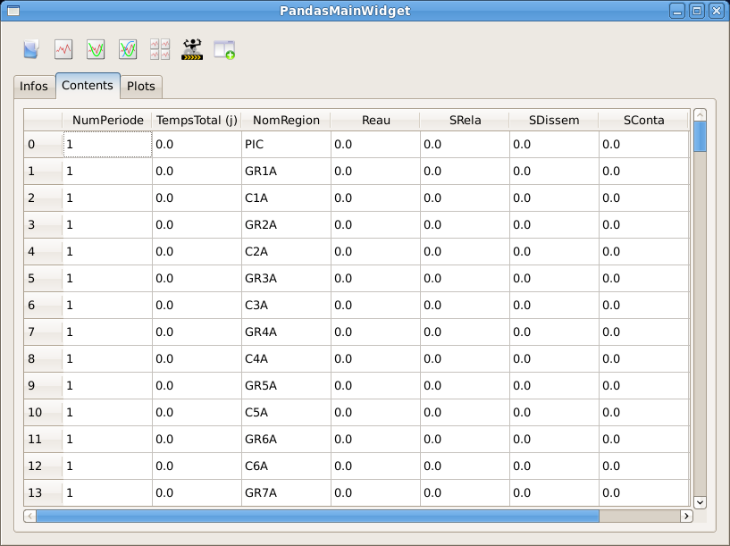
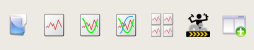
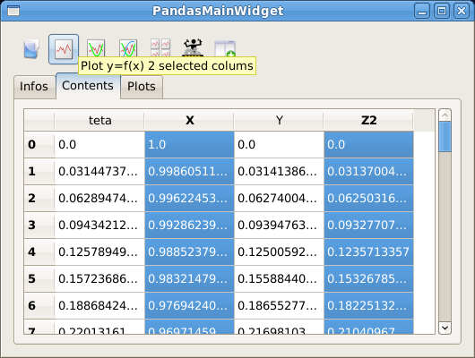
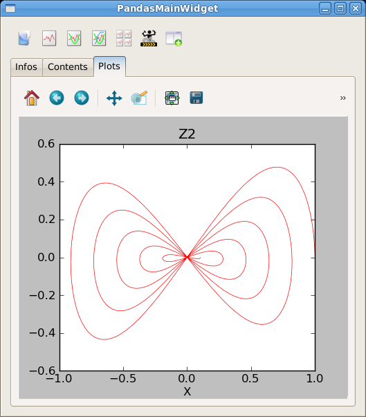
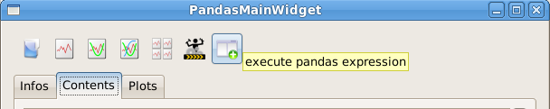
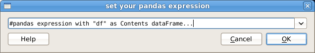
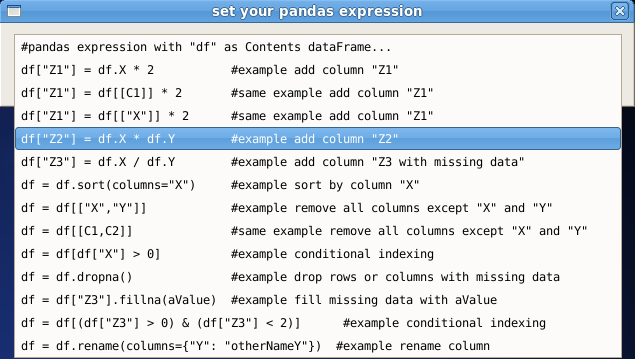
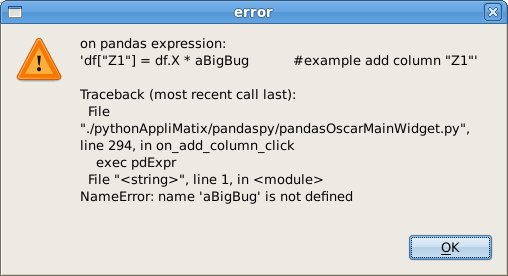

.. _oscarPPY:

Présentation de l'IHM OSCAR
==================================

L' IHM OSCAR est écrit en Python, **c'est un prototype**. Il utilise la bibliothèque PyQt4.
Plusieurs widgets utilisables sont présents dans PACKAGEPY

Prérequis
----------
Il faut vérifier la présence des :ref:`librairies python <prerequis>`.

Mise en oeuvre du package oscarPandasTest
------------------------------------------

* Décompresser le fichier oscarPandasTest.zip.
* Initialiser des variables d'environnement.
* Lancer tous les tests, pour vérification, un peu de patience.
* Lancer pandasOscarMainWidget.py, ou autres.

.. code-block:: bash

   export MYDIR=$HOME/MyChoice   #par example
   mkdir $MYDIR
   cd $MYDIR
   unzip WhereItIs/oscarPandasTest.zip
   export PATH=$MYDIR/packagespy/pythonAppliMatix:$PATH
   export WORKDIR4OSCAR=$HOME/resultats_oscar   #par example
   ./packagespy/AllTestLauncher.sh   #lancer tous les tests
   ./packagespy/pythonAppliMatix/pandaspy/pandasOscarMainWidget.py

Description de pandasOscarMainWidget
------------------------------------

| Ce widget permet de lire un fichier .csv dans le contexte OSCAR.
| Il utilise la librairie python `PANDAS <http://pandas.pydata.org/index.html>`_ (Python Data Analysis Library) pour la gestion des données, 
| Il utilise la librairie `MATPLOTLIB <http://matplotlib.org>`_ pour le tracé de courbes.

Ces fichiers ont deux parties principales: 

* Un en-tête informatif, qu'on retrouvera dans l'onglet "Infos", quelques lignes.
* Une table de données (lignes, colonnes), de taille plus conséquente, qu'on retrouvera dans l'onglet "Contents"

A partir de l'onglet "Contents" et de la barre d'outils, il est possible de:

* Sélectionner une ou plusieurs colonnes. 
  Puis de demander le tracé de courbe(s) par la barre d'outils. 
  Le tracé MATPLOTLIB apparait dans l'onglet "Plots", associé à la 
  `barre d'outils MATPLOTLIB <http://matplotlib.org/users/navigation_toolbar.html?highlight=toolbar>`_ 
  classique.
* Créer, supprimer, calculer de nouvelle(s) colonnes.
* Filter les lignes de la table, 
  c'est a dire déterminer un sous-ensemble de "Contents".
  
Barre d'outils.
...............

.. _outils:

Sont présents dans cette "toolBar" sept actions, de gauche à droite:

#. Lecture d'un fichier OSCAR .csv. Le répertoire initial de recherche est initialisé par la variable d'environnement "$WORKDIR4OSCAR".
#. Tracé d'une courbe y=f(x), 2 colonnes (x,y) sélectionnées dans "Contents".
#. Tracé de 2 courbes y1,y2=f(x), deux axes d'ordonnées distincts, 3 colonnes (x,y1,y2) sélectionnées dans "Contents".
#. Tracé de n courbes y1,...yn=f(x), n+1 colonnes (x,y1,...yn) sélectionnées dans "Contents".
#. Tracé de n courbes distinctes y1,...yn=f(x), n+1 colonnes (x,y1,...yn) sélectionnées dans "Contents".
#. Initialisation d'une table "ellipse" dans "Contents" (pour exemple), avec un tracé de l'ellipse.
#. Exécution d'expressions `PANDAS <http://pandas.pydata.org/index.html>`_, modification à la volée de "Contents".

Exemple de tracé.
..................

Par cette sélection, exemple sur "ellipse (X, Z2=X*Y)":

On obtient ce tracé:

Exemple d'expressions PANDAS.
.............................

Par l'action Exécution d'expressions `PANDAS <http://pandas.pydata.org/index.html>`_ de la barre d'outils_ ,
il est possible de modifier "Contents".

Une boite de dialogue est proposée.

   
Elle contient quelques exemples d'expressions `PANDAS <http://pandas.pydata.org/index.html>`_, RTFM svp.

En cas d'erreur un diagnostic est présenté.

