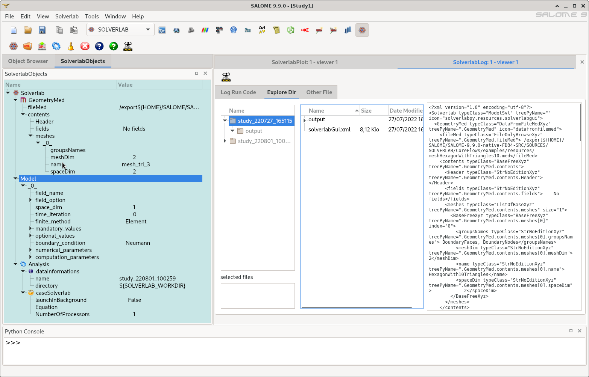

## PACKAGESPY

- Is a python package initially designed for
  [SALOME](http://www.salome-platform.org)-MATIX platform,
  *and* others standalone application(s).

  - to display-set input data for codes
  - to launch MATIX codes, and others
  - to display results (actions from result files-data codes)

- Is all python scripts to design PyQt5 GUI widgets and actions **generically**
, principally through PyQt5 TreeView widget, for *simplicity*.

- Have recently get development for [IRADINA](https://sourceforge.net/projects/iradina) and [SOLVERLAB](https://github.com/ndjinga/SOLVERLAB) codes

- Could be used outside SALOME platform as standalone implementation (with only Python3 PyQt5 etc. prerequisites)

### Installation

- see [README_installation](./READMES/README_installation.md) etc.

### Tests

- see [README_launch_tests](./READMES/README_launch_tests.md) etc.

### Example of SOLVERLABGUI implementation

- in SALOME Desktop

  
